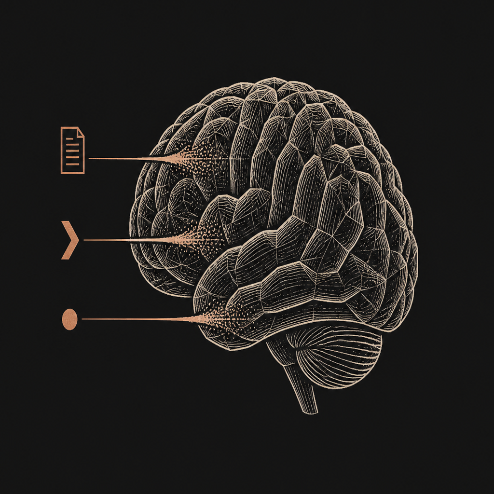

<h1 align="center">skill-index</h1>

  

  
  
  

  
  
  

  A skill library for <b>Grok Bot</b>. Ask for the job in plain English. The bot picks up one skill. Your bot instructions stay short.

## Contents

- [Use it in the real world](#use-it-in-the-real-world)
- [Install](#install)
- [Add it to your Grok bots](#add-it-to-your-grok-bots)
- [What's in this plugin](#whats-in-this-plugin)
- [What are skills](#what-are-skills)
- [License](#license)

## Use it in the real world

You do not paste every job into the bot. You ask for the work.

| You say | What happens |
| --- | --- |
| "Write a short release note." | One skill matches. The bot uses that one. |
| "Check this class deck and this pull request." | Two skills fit. The bot names both and uses neither, so you can pick. |
| "Is there a skill for organizing invoices?" | The bot looks through the skill marketplaces you connected and shows matches. Nothing is added until you say add. |

The same skill found in more than one marketplace is one entry, with a link for each place. A copy from the same repo, or a fork of that repo, is another link. A different skill stays its own entry.

## Install

1. Copy this folder to `~/.cursor/plugins/local/skill-index`.
2. Reload the window.
3. Ask a Grok bot: "Write a short release note."

The plugin ships with an empty SQLite library and a default list of marketplaces to search. Search results are shown to you. They are not saved.

Only a skill you add is written to that library. Connecting a marketplace does not fill the database.

You can add other marketplace links for search. Those extra links work the same way. Search only. Nothing is saved until you add a skill.

## Add it to your Grok bots

Your bots do not need a long instruction file for every job.

1. Install the plugin (above).
2. In the bot you want to use it, keep a short line: before a multi-step job, check the skill index and load at most one skill.
3. Ask that bot for the job. It matches keywords and picks up one skill.
4. To grow the library, ask: "Is there a skill for this?" The bot shows what it found. Say add. That skill is then available to your bots.

A skill does not overwrite who the bot is. The bot's own rules still win.

## What's in this plugin

| Piece | What it is for |
| --- | --- |
| [Find a skill](skills/find-skill/SKILL.md) | You do not know the name. The bot looks and shows matches. |
| [Skill index](skills/skill-index/SKILL.md) | How a bot picks one skill, or none. |
| [Import a skill](skills/import-agent-skill/SKILL.md) | Adds a skill you approved into your local library. |
| [Always-on line](rules/skill-index.mdc) | The short rule the bot keeps. Unused skills stay out of the chat. |
| [Starter skills](starters/file-index/index.md) | Three examples: release note, class deck check, pull request check. |
| [Marketplaces](marketplaces.json) | Six places the plugin can look. You can add your own. |

## What are skills

A skill is a saved way to do one job. It lives in its own file, not in the bot's standing instructions.

The bot sees a short label: the name, and when to use it. The full instructions load only when that job is the one you asked for. That is why the bot stays light, and why unused jobs stop burning tokens.

This plugin is the library and the lookup. It is not a dump of other people's skills. You choose what gets added.

## License

MIT. Author: SathiaAI.
